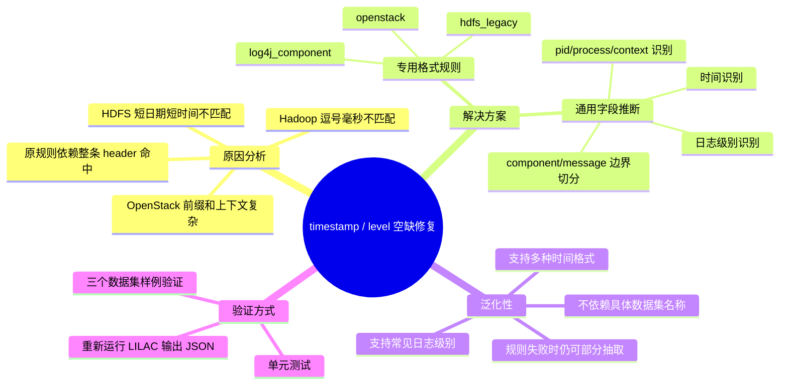

# LILAC 日志头字段空缺修复说明

## 1. 问题背景

在使用 Loghub-2.0 的 `HDFS_2k`、`Hadoop_2k`、`OpenStack_2k` 测试 LILAC 时，结果中大量出现：

```json
{
  "timestamp": "",
  "level": ""
}
```

这不是因为原始日志中没有时间或日志级别，而是原来的 `LogPreprocessor` 过度依赖“整条日志头正则完全命中”。当日志格式与已有规则稍有不同，例如 Hadoop 的逗号毫秒、HDFS 的短日期短时间、OpenStack 的文件名前缀与请求上下文，规则就无法命中，字段便保持为空。

## 2. 修改文件

本次主要修改两个文件：

```text
server/diagnose/lilac/preprocessor.py
tests/lilac/test_preprocessor.py
```

新增说明文档：

```text
docs/lilac_header_field_fix.md
```

## 3. 修改思路

本次修复没有把字段抽取交给 LLM，而是采用更稳定、便宜、可复现的方式：

```text
专用格式规则 + 通用字段级推断
```

也就是说：

```text
1. 对已知格式使用高置信正则规则。
2. 如果整条规则没有命中，再用通用推断抽取 timestamp、level、pid、component、message。
3. 能抽多少抽多少，不再因为整条日志头没匹配上就全部放弃。
```

## 4. 具体修改内容

### 4.1 增加已知格式规则

在 `server/diagnose/lilac/preprocessor.py` 中新增了三类高置信日志头规则：

```text
hdfs_legacy
log4j_component
openstack
```

分别覆盖：

```text
HDFS:
081109 203615 148 INFO dfs.DataNode$PacketResponder: message

Hadoop / log4j:
2015-10-18 18:01:47,978 INFO [main] org.xxx.Class: message

OpenStack:
nova-api.log... 2017-05-16 00:00:00.008 25746 INFO nova.component [req-...] message
```

### 4.2 扩展 ISO 时间识别

原规则主要支持：

```text
2024-03-15 10:23:01.123
```

现在同时支持：

```text
2024-03-15 10:23:01,123
```

也就是兼容点号毫秒和逗号毫秒。

### 4.3 增加通用字段级推断

新增 `_infer_header()` 兜底逻辑。即使没有专用规则命中，也会尝试在日志行开头附近识别：

```text
timestamp
level
pid
process
context
component
body/message
```

支持的常见时间形式包括：

```text
2015-10-18 18:01:47,978
2017-05-16 00:00:00.008
081109 203615
Mar 15 10:23:01
2026-06-01T12:30:45Z
1715612862.123
```

支持的日志级别包括：

```text
DEBUG
INFO
INFORMATION
NOTICE
WARN
WARNING
ERROR
ERR
FATAL
CRITICAL
TRACE
SEVERE
```

### 4.4 增加解析来源与置信度

输出的 `metadata` 中会包含：

```text
header_parse_source
header_parse_confidence
```

例如：

```json
{
  "header_parse_source": "hdfs_legacy",
  "header_parse_confidence": "1.0"
}
```

这能帮助后续判断字段是由高置信规则抽取，还是由通用推断抽取。

## 5. 修改后的预期效果

### HDFS

原始日志：

```text
081109 203615 148 INFO dfs.DataNode$PacketResponder: PacketResponder 1 for block blk_38865049064139660 terminating
```

修复后：

```json
{
  "timestamp": "081109 203615",
  "level": "INFO",
  "pid": "148",
  "component": "dfs.DataNode$PacketResponder",
  "message": "PacketResponder 1 for block blk_38865049064139660 terminating"
}
```

### Hadoop

原始日志：

```text
2015-10-18 18:01:47,978 INFO [main] org.apache.hadoop.mapreduce.v2.app.MRAppMaster: Created MRAppMaster for application appattempt_1445144423722_0020_000001
```

修复后：

```json
{
  "timestamp": "2015-10-18 18:01:47,978",
  "level": "INFO",
  "process": "main",
  "component": "org.apache.hadoop.mapreduce.v2.app.MRAppMaster",
  "message": "Created MRAppMaster for application appattempt_1445144423722_0020_000001"
}
```

### OpenStack

原始日志：

```text
nova-api.log.1.2017-05-16_13:53:08 2017-05-16 00:00:00.008 25746 INFO nova.osapi_compute.wsgi.server [req-...] 10.11.10.1 "GET /v2/..." status: 200 len: 1893 time: 0.2477829
```

修复后：

```json
{
  "timestamp": "2017-05-16 00:00:00.008",
  "level": "INFO",
  "pid": "25746",
  "component": "nova.osapi_compute.wsgi.server",
  "message": "10.11.10.1 \"GET /v2/...\" status: 200 len: 1893 time: 0.2477829"
}
```

## 6. 修改流程思维导图



## 7. 如何验证

运行预处理器单元测试：

```bat
cd /d C:\Users\liuPP\Desktop\sundb-ai-ops-feat-lilac-drain3
python -m pytest tests\lilac\test_preprocessor.py -q
```

本次验证结果：

```text
19 passed
```

## 8. 重新跑三个数据集的注意事项

由于 `body/message` 现在会更准确地剥离日志头，重新跑 LILAC 后，`template` 也会更接近官方金标准的 `EventTemplate`。建议重新跑之前清空缓存：

```bat
curl.exe -X DELETE http://localhost:7861/diagnose/lilac/cache
```

然后重新执行三个数据集解析命令，生成新的结果文件。否则历史缓存可能影响新旧结果对比。

