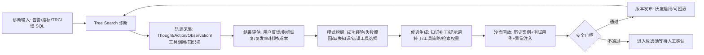

# SunDB AI-Ops 自进化模块可行方案

## 1. 目标定位

在现有 SunDB AI-Ops 数据库智能运维系统上新增一个“自进化模块”，让系统能够从真实诊断过程、用户反馈、修复后的运行指标和历史回放结果中持续沉淀经验，并把经验转化为可审计、可验证、可回滚的知识、策略和配置更新。

建议专利方向为：

> 一种基于诊断轨迹、运维结果反馈与安全门控的数据库智能运维自进化方法及系统

该方向不把“让大模型自己学习”作为模糊卖点，而是把创新点落在数据库运维场景下的闭环数据结构、候选改进生成、沙盒回放验证、安全门控发布和版本回滚机制上。这样更容易形成具体技术方案和可证明的技术效果。

说明：以下内容是技术方案与专利挖掘建议，不构成法律意见。正式申请前应做现有技术检索，并由专利代理师确认权利要求布局。

## 2. 现有项目基础

当前项目已经具备自进化闭环所需的关键底座：

| 已有能力 | 相关位置 | 可复用价值 |
| --- | --- | --- |
| Tree Search 诊断、推理步骤、节点评分、置信度 | `server/diagnose/tree_search_service.py` | 可作为自进化的过程数据来源 |
| 快速诊断 API、诊断结果、历史记录 | `server/diagnose/diagnose.py` | 可接入诊断后处理和结果采集 |
| 诊断记录、报告、工具、测试异常用例表 | `server/db/models/diagnosis_model.py` | 可扩展自进化数据模型 |
| BM25、向量、混合知识检索 | `server/diagnose/knowledge_loader.py`, `enhanced_knowledge_loader.py`, `integrated_knowledge_service.py` | 可被自进化模块动态调权和增量更新 |
| 用户反馈入口 | `server/chat/feedback.py`, `diagnose_user_feedback` | 可作为人工标签和偏好信号 |
| 诊断评估指标 | `server/diagnose/evaluation_metrics.py` | 可复用为候选策略验证指标 |
| 测试用例库 | `diagnostic_test_cases/` | 可作为沙盒回放基准集 |
| 前端诊断、报告、知识库页面 | `webui-react/` | 可新增自进化看板 |

因此可行路径不是重写诊断系统，而是在现有诊断链路外侧增加一个闭环控制层。

## 3. 核心闭环



闭环的关键是“先生成候选，再验证发布”。所有自动产生的更新都必须带来源、证据、版本和评估报告，避免诊断系统在生产环境中无约束漂移。

## 4. 模块设计

当前已实现目录结构：

```text
server/evolution/
  __init__.py              ✅ V0.1
  schemas.py               ✅ V0.1  （EvolutionFeedbackInput）
  collector.py             ✅ V0.1  （脱敏采集、指纹、资产版本快照）
  evaluator.py             ✅ V0.1  （五维评分、正/负/不确定标签）
  pattern_miner.py         ✅ V0.2  （四种规则挖掘）
  candidate_generator.py   ✅ V0.2  （四种候选生成器）
  api.py                   ✅ V0.1+V0.2 （7 个路由）
  replay_runner.py         ⬜ V0.3 待开发
  gatekeeper.py            ⬜ V0.3 待开发
  registry.py              ⬜ V0.3 待开发
```

### 4.1 数据采集器 `collector.py`

采集每次诊断的完整上下文，形成标准化 `EvolutionCase`：

- 异常输入：告警类型、严重级别、时间窗口、指标快照、TRC 事件、慢 SQL。
- 推理轨迹：Tree Search 节点、推理步骤、工具调用、观察结果、被剪枝节点。
- 知识命中：BM25 分数、向量分数、最终知识块、引用来源。
- 输出结果：根因、解决方案、置信度、报告摘要。
- 反馈结果：用户评分、编辑内容、是否采纳、修复后指标是否恢复、是否复发。

接入点：

- 在 `quick_diagnose()` 完成后调用 `collector.capture_diagnosis_result()`。
- 在 `chat_feedback()` 和 `diagnose_user_feedback()` 中补充 `case_id` 关联。
- 在 `get_dashboard_metrics()` 或监控历史接口中采集修复后窗口指标。

### 4.2 结果评估器 `evaluator.py`

给每次诊断生成可量化标签：

```text
outcome_score =
  0.35 * root_cause_match_score +
  0.25 * metric_recovery_score +
  0.15 * user_feedback_score +
  0.15 * recurrence_penalty_score +
  0.10 * efficiency_score
```

其中：

- `root_cause_match_score`：与人工确认根因或测试集期望根因的匹配度。
- `metric_recovery_score`：建议执行后 CPU、内存、IO、锁等待、慢 SQL 等指标改善比例。
- `user_feedback_score`：用户评分、编辑幅度、采纳状态。
- `recurrence_penalty_score`：同类异常在指定窗口内是否复发。
- `efficiency_score`：诊断耗时、Token 成本、工具调用次数。

输出标签分为：

- `positive_case`：高质量诊断，可提炼为经验。
- `negative_case`：失败或低置信诊断，用于挖掘缺失知识、错误工具、提示词缺陷。
- `uncertain_case`：证据不足，进入人工复核。

### 4.3 模式挖掘器 `pattern_miner.py`

对历史案例做聚类和对比分析：

- 按异常类型、指标组合、SQL 特征、TRC 事件、工具调用路径聚类。
- 对比成功案例和失败案例，定位“差异步骤”。
- 识别知识库空洞，例如某类异常总是低置信、检索不到合适知识块。
- 识别工具选择偏差，例如慢 SQL 场景频繁未调用 `explain_query` 或索引建议工具。
- 识别提示词问题，例如根因描述泛化、解决方案缺少可执行 SQL、证据引用缺失。

产出 `EvolutionPattern`：

```json
{
  "pattern_type": "missing_knowledge",
  "anomaly_cluster": "slow_query_missing_index",
  "evidence_case_ids": [101, 118, 132],
  "failure_signature": "检索知识不足且解决方案未包含索引建议",
  "suggested_update_type": "knowledge_patch",
  "confidence": 0.82
}
```

### 4.4 候选生成器 `candidate_generator.py`

根据模式生成四类候选更新：

| 候选类型 | 示例 | 发布目标 |
| --- | --- | --- |
| 知识补丁 | 新增根因知识块、诊断步骤、关联指标 | `doc2knowledge` 或知识库 |
| 检索策略补丁 | 调整 BM25/向量融合权重、top_k、阈值 | `enhanced_knowledge_loader.py` 相关配置 |
| 工具策略补丁 | 为异常簇推荐工具调用顺序和必要工具 | Tree Search 工具选择策略 |
| 提示词补丁 | 补充输出格式、证据要求、反思规则 | prompt 配置或 Tree Search prompt |

候选必须包含：

- 来源案例列表。
- 修改前问题。
- 修改后内容。
- 预期收益。
- 风险等级。
- 可回滚版本号。
- 是否允许自动发布。

### 4.5 沙盒回放器 `replay_runner.py`

候选不能直接进入线上诊断链路，必须先在沙盒中回放：

- 使用 `diagnostic_test_cases/` 的标准案例做回归测试。
- 使用历史 `diagnosis_records` 构造离线回放集。
- 对异常注入模块生成的典型故障做压力验证。
- 对比基线版本和候选版本的 Top-1 准确率、Top-3 命中率、平均诊断耗时、置信度校准、工具调用成本。

建议输出：

```json
{
  "candidate_id": 42,
  "baseline_accuracy": 0.72,
  "candidate_accuracy": 0.81,
  "latency_change": 0.08,
  "regression_cases": [],
  "pass": true
}
```

### 4.6 安全门控 `gatekeeper.py`

发布规则建议：

- 准确率提升不低于 5% 或关键异常类别提升不低于 10%。
- 不允许高优先级测试用例回退。
- 平均诊断耗时增加不超过 20%。
- 高风险 SQL 建议必须进入人工确认。
- 任何模型生成的新知识必须有至少 2 条案例证据或 1 条人工确认。
- 候选发布后先灰度，只影响新诊断请求的部分流量或指定用户。

发布动作分为：

- `auto_promote`：低风险知识补丁、检索阈值微调。
- `manual_review`：工具策略、提示词、可能影响 SQL 建议的更新。
- `reject`：回放退化或证据不足。

### 4.7 版本注册表 `registry.py`

管理所有可演化资产版本：

- 知识库版本。
- 检索策略版本。
- 工具策略版本。
- 提示词版本。
- 评估报告版本。

每次诊断记录应写入当时使用的资产版本，方便追责和回滚。

## 5. 数据库扩展建议

文件：`server/db/models/evolution_model.py`

| 表名 | 状态 | 作用 | 关键字段 |
| --- | --- | --- | --- |
| `evolution_cases` | ✅ V0.1 | 标准化诊断案例 | `record_id`, `case_fingerprint`, `input_snapshot`, `trace_snapshot`, `outcome_score`, `label` |
| `evolution_feedback` | ✅ V0.1 | 反馈和修复结果 | `case_id`, `feedback_type`, `score`, `accepted`, `metric_recovery`, `recurrence` |
| `evolution_patterns` | ✅ V0.2 | 挖掘出的模式 | `pattern_type`, `cluster_key`, `evidence_case_ids`, `confidence`, `status` |
| `evolution_candidates` | ✅ V0.2 | 候选更新 | `candidate_type`, `patch_content`, `risk_level`, `source_pattern_id`, `status` |
| `evolution_experiments` | ⬜ V0.3 | 沙盒回放结果 | `candidate_id`, `baseline_metrics`, `candidate_metrics`, `regressions`, `pass_gate` |
| `evolution_artifacts` | ⬜ V0.3 | 已发布资产版本 | `artifact_type`, `version`, `content_hash`, `rollback_to`, `active` |

这些表与已有 `diagnosis_records` 通过 `record_id` 关联即可，不需要侵入原有诊断表。

## 6. API 与前端

后端路由挂载到 `server/api.py`：

| API | 方法 | 用途 | 状态 |
| --- | --- | --- | --- |
| `/evolution/cases` | GET | 查看自进化案例池（支持 label/status/anomaly_type 过滤、分页） | ✅ V0.1 已完成 |
| `/evolution/cases/{case_id}` | GET | 查看单个案例详情及反馈 | ✅ V0.1 已完成 |
| `/evolution/metrics` | GET | 查看自进化收益指标（含模式/候选计数） | ✅ V0.1 已完成 |
| `/evolution/feedback` | POST | 提交用户反馈，触发评分更新 | ✅ V0.1 已完成 |
| `/evolution/patterns` | GET | 查看挖掘出的模式（支持 pattern_type/status 过滤、分页） | ✅ V0.2 已完成 |
| `/evolution/candidates` | GET | 查看候选更新（支持 candidate_type/status/risk_level 过滤） | ✅ V0.2 已完成 |
| `/evolution/candidates/generate` | POST | 触发模式挖掘 + 候选生成，结果持久化 | ✅ V0.2 已完成 |
| `/evolution/replay/{candidate_id}` | POST | 触发沙盒回放 | ⬜ V0.3 待开发 |
| `/evolution/promote/{candidate_id}` | POST | 发布候选 | ⬜ V0.3 待开发 |
| `/evolution/rollback/{artifact_type}/{version}` | POST | 回滚指定类型资产到历史版本 | ⬜ V0.3 待开发 |

前端建议新增 `webui-react/src/pages/Evolution/`：

- 自进化总览：案例数、候选数、已发布版本、准确率变化。
- 候选审批：展示修改内容、证据案例、回放指标、风险等级。
- 版本管理：当前知识/策略/提示词版本，支持回滚。
- 案例复盘：查看一次失败诊断如何转化为候选更新。

## 7. 阶段实施路线

### 第 1 阶段：MVP 闭环记录（**✅ 已完成**）

- `schemas.py`, `collector.py`, `evaluator.py`, `api.py` 均已实现。
- `evolution_cases` 和 `evolution_feedback` 两张表已建立（自动建表）。
- 诊断完成后记录输入、轨迹、知识命中、结果、资产版本（含文件 SHA-256）。
- 反馈接口已补充自进化反馈写入，支持 `record_id`/`evolution_case_id`/`accepted` 关联。
- 前端 Evolution 页面基础版已上线，Swagger 可查看全部 V0.1 接口。
- 评分器（五维加权评分）已实现并通过 4 个单元测试。

验收标准：✅ 全部达成

### 第 2 阶段：候选知识补丁（**✅ 已完成**）

- `pattern_miner.py` 实现四种规则挖掘（missing_knowledge / wrong_tool_selection / low_confidence_prompt / retrieval_weight_issue），零外部依赖。
- `candidate_generator.py` 实现四种候选生成器（knowledge_patch / tool_strategy_patch / prompt_patch / retrieval_strategy_patch），装饰器注册机制便于扩展。
- 新增 `evolution_patterns` 和 `evolution_candidates` 两张数据表。
- `POST /evolution/candidates/generate?min_cases=N` 一键触发完整挖掘 + 生成流程。
- 所有候选默认 `status="pending"`，不影响线上诊断。
- 18 个模式挖掘测试 + 10 个候选生成测试全部通过（累计 41 个测试）。

验收标准：✅ 全部达成

### 第 3 阶段：策略自进化，4 到 8 周

目标：从“知识演化”扩展到“检索和工具策略演化”。

- 实现混合检索权重候选。
- 实现工具调用策略候选，例如异常簇到工具序列的推荐。
- 实现 `gatekeeper.py` 的自动门控规则。
- 支持灰度版本和回滚。

验收标准：

- Top-3 根因命中率有可观测提升。
- 关键测试集无回退。
- 所有发布版本可追溯到候选、案例和实验报告。

### 第 4 阶段：专利样机和材料，8 到 12 周

目标：形成可演示、可度量、可写入专利说明书的完整样机。

- 准备 3 类典型案例：慢 SQL、锁等待、内存异常。
- 展示一次失败诊断如何通过闭环生成补丁并提升回放结果。
- 固化流程图、数据结构、评分公式、门控规则、版本回滚。
- 输出技术交底书，包括背景技术、发明内容、附图说明、具体实施例和效果数据。

验收标准：

- 至少 30 条历史或模拟案例。
- 至少 3 个候选更新通过沙盒验证。
- 至少 1 个候选发布后在回放集上提升 10% 以上关键指标。

## 8. 专利挖掘重点

建议围绕以下技术特征组织专利，而不是泛泛描述“大模型自学习”。

### 8.1 可作为独立权利要求的主方案

一种数据库智能运维自进化方法，包括：

1. 获取数据库异常输入、诊断树推理轨迹、工具调用结果、知识检索结果和诊断输出。
2. 根据用户反馈、修复后指标恢复情况、复发情况和诊断成本计算诊断结果评分。
3. 对多个诊断案例进行聚类和成功失败对比，识别缺失知识、错误工具选择或提示词缺陷。
4. 生成带证据链的候选更新，候选更新包括知识补丁、检索策略补丁、工具策略补丁或提示词补丁。
5. 使用历史案例和测试案例对候选更新进行沙盒回放，得到候选版本相对基线版本的效果指标。
6. 根据安全门控规则决定发布、人工复核或拒绝候选更新。
7. 对发布后的知识、策略或提示词版本进行记录，并在诊断时绑定版本号以支持回滚。

### 8.2 可能的从属创新点

- 基于 Tree Search 节点的失败定位方法：定位低质量 Thought/Action/Observation 节点，并将其映射为知识缺失或工具选择错误。
- 基于修复后指标窗口的自动标签方法：不是只用人工点赞，而是结合 CPU、内存、IO、锁等待、慢 SQL 恢复程度。
- 基于“候选补丁-沙盒回放-门控发布”的数据库运维知识自演化机制。
- 面向数据库故障的多资产联动演化：知识、检索权重、工具序列、提示词同时版本化管理。
- 带回滚和灰度的自进化资产注册表。
- 用复发率惩罚错误修复建议，避免短期指标恢复但故障重复出现。

### 8.3 技术效果表达

专利文本中可以强调以下效果：

- 提升数据库故障根因定位准确率。
- 降低重复故障的平均诊断时间。
- 减少错误工具调用和无效知识检索。
- 使自生成知识在进入生产诊断前经过自动回放验证。
- 保证自进化过程可审计、可追溯、可回滚。

## 9. 与公开技术的区分建议

现有项目和公开论文已经包含 LLM 诊断、多智能体、知识检索和用户反馈。新增专利点应尽量避开这些已公开内容，突出以下差异：

- 从“用户反馈优化回答”扩展为“多源结果标签驱动的诊断资产版本演化”。
- 从“知识库检索”扩展为“知识补丁自动生成、回放验证、门控发布”。
- 从“单次诊断”扩展为“跨案例聚类、失败模式挖掘和策略更新”。
- 从“提示词或模型微调”扩展为“知识、检索、工具、提示词四类资产的协同演化”。
- 从“经验沉淀”扩展为“带证据链、版本号和回滚机制的生产级自进化闭环”。

## 10. 风险与控制

| 风险 | 影响 | 控制措施 |
| --- | --- | --- |
| 模型生成错误知识 | 可能污染知识库 | 候选状态默认 pending，必须通过回放和门控 |
| 生产数据敏感 | SQL、日志可能含业务数据 | 采集时脱敏，SQL 字面量归一化，敏感字段哈希 |
| 自进化导致性能下降 | 诊断耗时增加 | 门控限制耗时增幅，保留快速回滚 |
| 已有公开技术影响专利新颖性 | 可能影响授权 | 申请前做现有技术检索，聚焦新增闭环机制 |
| 自动执行优化 SQL 风险高 | 可能影响数据库稳定性 | 第一阶段只建议不执行，高风险动作人工审批 |

## 11. 代码落地清单（当前状态）

**V0.1 已完成：**

```text
server/evolution/__init__.py
server/evolution/schemas.py
server/evolution/collector.py
server/evolution/evaluator.py
server/evolution/api.py                        （V0.1+V0.2 共 7 个路由）
server/db/models/evolution_model.py            （EvolutionCase/Feedback/Pattern/Candidate）
server/db/repository/evolution_repository.py   （18 个仓储函数）
tests/unit/test_evolution_collector.py
tests/unit/test_evolution_evaluator.py
tests/unit/test_evolution_api.py
```

改造点：

- `server/diagnose/diagnose.py`：✅ 诊断完成后调用采集器（try/except 旁路）。
- `server/chat/feedback.py`：✅ 反馈写入自进化反馈表。
- `server/api.py`：✅ 挂载 `/evolution/*` 7 个路由。
- `webui-react/src/pages/Evolution/`：✅ 基础页面已上线。

**V0.2 已完成：**

```text
server/evolution/pattern_miner.py              （四种规则挖掘）
server/evolution/candidate_generator.py        （四种候选生成器）
tests/unit/test_evolution_pattern_miner.py     （18 个测试）
tests/unit/test_evolution_candidate_generator.py （10 个测试）
```

**V0.3 待开发：**

```text
server/evolution/replay_runner.py
server/evolution/gatekeeper.py
server/evolution/registry.py
server/db/models/evolution_model.py            （追加 EvolutionExperiment/EvolutionArtifact）
tests/unit/test_evolution_gatekeeper.py
```

## 12. 建议的专利材料包

在准备专利交底书时，建议同时整理：

- 系统架构图。
- 自进化闭环流程图。
- `EvolutionCase`、`EvolutionPattern`、`EvolutionCandidate` 数据结构。
- 结果评分公式和安全门控规则。
- 沙盒回放前后指标对比表。
- 三个具体实施例：慢 SQL、锁等待、内存异常。
- 版本发布和回滚示意图。
- 与现有 D-Bot/DB-GPT 能力的区别说明。

## 13. 参考

- 中国国家知识产权局公开的《中华人民共和国专利法》修法内容中，发明和实用新型通常需要考虑新颖性、创造性和实用性，见 CNIPA: <https://www.cnipa.gov.cn/art/2020/11/23/art_2197_155169.html>
- USPTO Patent Essentials 对实用专利的基础要求也强调可使用、可清楚描述、新颖和非显而易见，见 USPTO: <https://www.uspto.gov/patents/basics/essentials>
